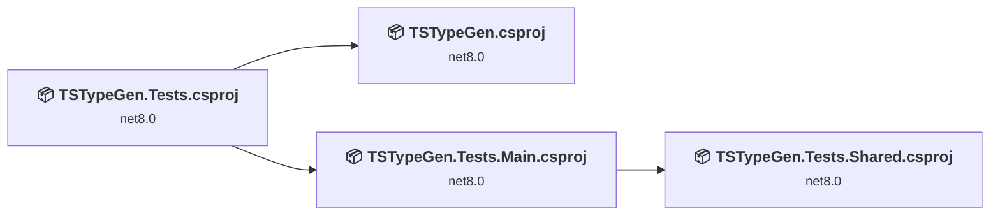
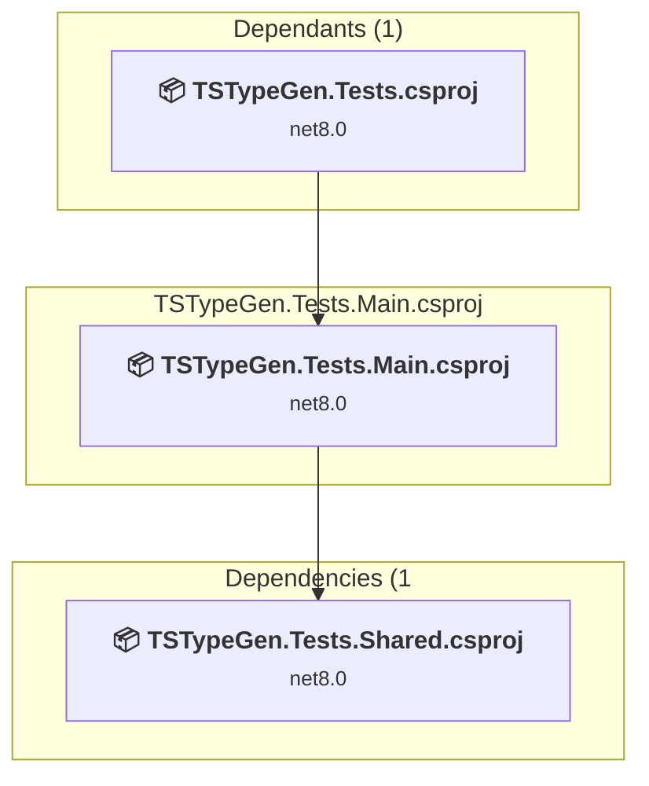
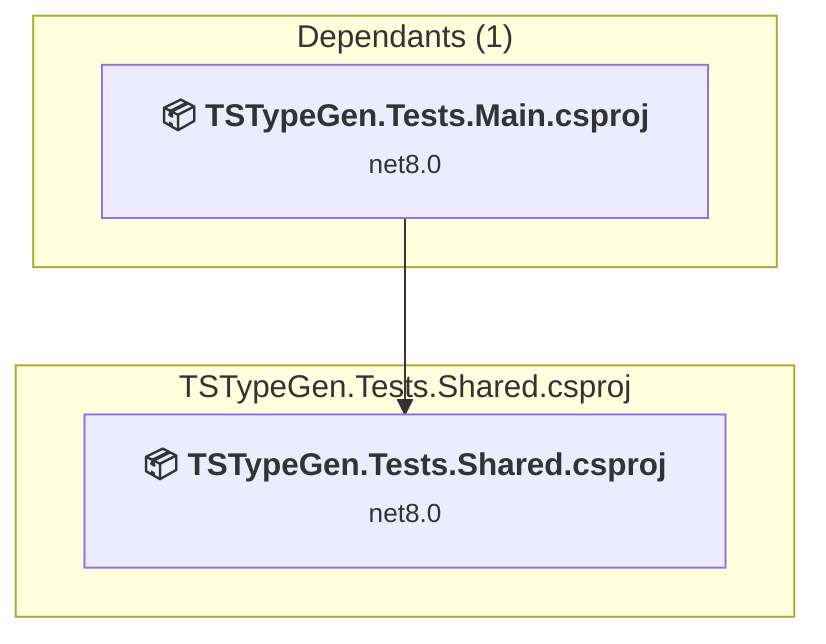
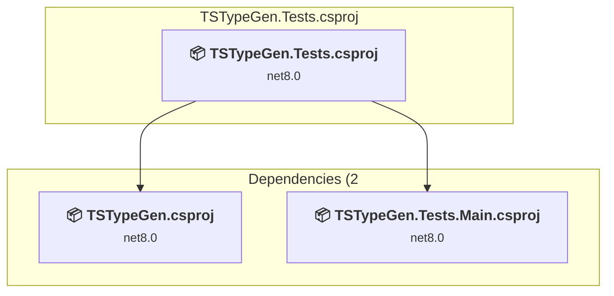
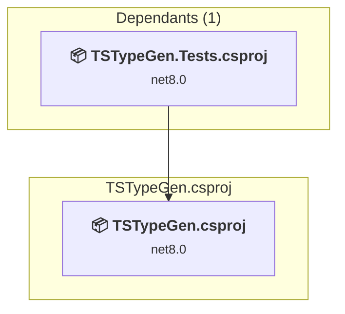

# Projects and dependencies analysis

This document provides a comprehensive overview of the projects and their dependencies in the context of upgrading to .NETCoreApp,Version=v10.0.

## Table of Contents

- [Executive Summary](#executive-Summary)
  - [Highlevel Metrics](#highlevel-metrics)
  - [Projects Compatibility](#projects-compatibility)
  - [Package Compatibility](#package-compatibility)
  - [API Compatibility](#api-compatibility)
  - [Binding Redirect Configuration](#binding-redirect-configuration)
- [Aggregate NuGet packages details](#aggregate-nuget-packages-details)
- [Top API Migration Challenges](#top-api-migration-challenges)
  - [Technologies and Features](#technologies-and-features)
  - [Most Frequent API Issues](#most-frequent-api-issues)
- [Projects Relationship Graph](#projects-relationship-graph)
- [Project Details](#project-details)

  - [src\TSTypeGen.Tests.Main\TSTypeGen.Tests.Main.csproj](#srctstypegentestsmaintstypegentestsmaincsproj)
  - [src\TSTypeGen.Tests.Shared\TSTypeGen.Tests.Shared.csproj](#srctstypegentestssharedtstypegentestssharedcsproj)
  - [src\TSTypeGen.Tests\TSTypeGen.Tests.csproj](#srctstypegentestststypegentestscsproj)
  - [src\TSTypeGen\TSTypeGen.csproj](#srctstypegentstypegencsproj)

## Executive Summary

### Highlevel Metrics

| Metric | Count | Status |
| :--- | :---: | :--- |
| Total Projects | 4 | All require upgrade |
| Total NuGet Packages | 17 | 4 need upgrade |
| Total Code Files | 59 |  |
| Total Code Files with Incidents | 6 |  |
| Total Lines of Code | 3698 |  |
| Total Number of Issues | 29 |  |
| Estimated LOC to modify | 17+ | at least 0,5% of codebase |

### Projects Compatibility

| Project | Target Framework | Difficulty | Package Issues | API Issues | Binding Issues | Est. LOC Impact | Description |
| :--- | :---: | :---: | :---: | :---: | :---: | :---: | :--- |
| [src\TSTypeGen.Tests.Main\TSTypeGen.Tests.Main.csproj](#srctstypegentestsmaintstypegentestsmaincsproj) | net8.0 | 🟢 Low | 0 | 0 | 0 |  | ClassLibrary, Sdk Style = True |
| [src\TSTypeGen.Tests.Shared\TSTypeGen.Tests.Shared.csproj](#srctstypegentestssharedtstypegentestssharedcsproj) | net8.0 | 🟢 Low | 0 | 0 | 0 |  | ClassLibrary, Sdk Style = True |
| [src\TSTypeGen.Tests\TSTypeGen.Tests.csproj](#srctstypegentestststypegentestscsproj) | net8.0 | 🟢 Low | 4 | 0 | 0 |  | DotNetCoreApp, Sdk Style = True |
| [src\TSTypeGen\TSTypeGen.csproj](#srctstypegentstypegencsproj) | net8.0 | 🟢 Low | 4 | 17 | 0 | 17+ | DotNetCoreApp, Sdk Style = True |

### Package Compatibility

| Status | Count | Percentage |
| :--- | :---: | :---: |
| ✅ Compatible | 13 | 76,5% |
| ⚠️ Incompatible | 0 | 0,0% |
| 🔄 Upgrade Recommended | 4 | 23,5% |
| ***Total NuGet Packages*** | ***17*** | ***100%*** |

### API Compatibility

| Category | Count | Impact |
| :--- | :---: | :--- |
| 🔴 Binary Incompatible | 0 | High - Require code changes |
| 🟡 Source Incompatible | 17 | Medium - Needs re-compilation and potential conflicting API error fixing |
| 🔵 Behavioral change | 0 | Low - Behavioral changes that may require testing at runtime |
| ✅ Compatible | 3380 |  |
| ***Total APIs Analyzed*** | ***3397*** |  |

## Aggregate NuGet packages details

| Package | Current Version | Suggested Version | Projects | Description |
| :--- | :---: | :---: | :--- | :--- |
| Microsoft.CodeCoverage | 17.12.0 |  | [TSTypeGen.csproj](#srctstypegentstypegencsproj) [TSTypeGen.Tests.csproj](#srctstypegentestststypegentestscsproj) | ✅Compatible |
| Microsoft.Extensions.FileSystemGlobbing | 8.0.0 | 10.0.11 | [TSTypeGen.csproj](#srctstypegentstypegencsproj) [TSTypeGen.Tests.csproj](#srctstypegentestststypegentestscsproj) | NuGet package upgrade is recommended |
| Microsoft.NET.Test.Sdk | 17.12.0 |  | [TSTypeGen.csproj](#srctstypegentstypegencsproj) [TSTypeGen.Tests.csproj](#srctstypegentestststypegentestscsproj) | ✅Compatible |
| Microsoft.TestPlatform.ObjectModel | 17.12.0 |  | [TSTypeGen.csproj](#srctstypegentstypegencsproj) [TSTypeGen.Tests.csproj](#srctstypegentestststypegentestscsproj) | ✅Compatible |
| Microsoft.TestPlatform.TestHost | 17.12.0 |  | [TSTypeGen.csproj](#srctstypegentstypegencsproj) [TSTypeGen.Tests.csproj](#srctstypegentestststypegentestscsproj) | ✅Compatible |
| Mono.Options | 6.12.0.148 |  | [TSTypeGen.csproj](#srctstypegentstypegencsproj) [TSTypeGen.Tests.csproj](#srctstypegentestststypegentestscsproj) | ✅Compatible |
| Newtonsoft.Json | 13.0.3 | 13.0.4 | [TSTypeGen.csproj](#srctstypegentstypegencsproj) [TSTypeGen.Tests.csproj](#srctstypegentestststypegentestscsproj) | NuGet package upgrade is recommended |
| Nuclear.Assemblies | 1.2.0 |  | [TSTypeGen.csproj](#srctstypegentstypegencsproj) [TSTypeGen.Tests.csproj](#srctstypegentestststypegentestscsproj) | ✅Compatible |
| Nuclear.Creation | 1.3.0 |  | [TSTypeGen.csproj](#srctstypegentstypegencsproj) [TSTypeGen.Tests.csproj](#srctstypegentestststypegentestscsproj) | ✅Compatible |
| Nuclear.Exceptions | 2.3.0 |  | [TSTypeGen.csproj](#srctstypegentstypegencsproj) [TSTypeGen.Tests.csproj](#srctstypegentestststypegentestscsproj) | ✅Compatible |
| Nuclear.Extensions | 2.0.4 |  | [TSTypeGen.csproj](#srctstypegentstypegencsproj) [TSTypeGen.Tests.csproj](#srctstypegentestststypegentestscsproj) | ✅Compatible |
| Nuclear.SemVer | 1.2.0 |  | [TSTypeGen.csproj](#srctstypegentstypegencsproj) [TSTypeGen.Tests.csproj](#srctstypegentestststypegentestscsproj) | ✅Compatible |
| NUnit | 4.2.2 |  | [TSTypeGen.csproj](#srctstypegentstypegencsproj) [TSTypeGen.Tests.csproj](#srctstypegentestststypegentestscsproj) | ✅Compatible |
| NUnit3TestAdapter | 4.6.0 |  | [TSTypeGen.csproj](#srctstypegentstypegencsproj) [TSTypeGen.Tests.csproj](#srctstypegentestststypegentestscsproj) | ✅Compatible |
| System.CodeDom | 8.0.0 | 10.0.11 | [TSTypeGen.csproj](#srctstypegentstypegencsproj) [TSTypeGen.Tests.csproj](#srctstypegentestststypegentestscsproj) | NuGet package upgrade is recommended |
| System.Reflection.Metadata | 1.6.0 |  | [TSTypeGen.csproj](#srctstypegentstypegencsproj) [TSTypeGen.Tests.csproj](#srctstypegentestststypegentestscsproj) | ✅Compatible |
| System.Reflection.MetadataLoadContext | 8.0.1 | 10.0.11 | [TSTypeGen.csproj](#srctstypegentstypegencsproj) [TSTypeGen.Tests.csproj](#srctstypegentestststypegentestscsproj) | NuGet package upgrade is recommended |

## Top API Migration Challenges

### Technologies and Features

| Technology | Issues | Percentage | Migration Path |
| :--- | :---: | :---: | :--- |

### Most Frequent API Issues

| API | Count | Percentage | Category |
| :--- | :---: | :---: | :--- |
| T:System.Reflection.PathAssemblyResolver | 7 | 41,2% | Source Incompatible |
| T:System.Reflection.MetadataLoadContext | 2 | 11,8% | Source Incompatible |
| M:System.Reflection.MetadataLoadContext.LoadFromAssemblyPath(System.String) | 2 | 11,8% | Source Incompatible |
| M:System.Reflection.MetadataAssemblyResolver.#ctor | 2 | 11,8% | Source Incompatible |
| M:System.Reflection.PathAssemblyResolver.Resolve(System.Reflection.MetadataLoadContext,System.Reflection.AssemblyName) | 1 | 5,9% | Source Incompatible |
| T:System.Reflection.MetadataAssemblyResolver | 1 | 5,9% | Source Incompatible |
| M:System.Reflection.MetadataLoadContext.#ctor(System.Reflection.MetadataAssemblyResolver,System.String) | 1 | 5,9% | Source Incompatible |
| M:System.Reflection.PathAssemblyResolver.#ctor(System.Collections.Generic.IEnumerable{System.String}) | 1 | 5,9% | Source Incompatible |

## Projects Relationship Graph

Legend:
📦 SDK-style project
⚙️ Classic project

## Project Details

### src\TSTypeGen.Tests.Main\TSTypeGen.Tests.Main.csproj

#### Project Info

- **Current Target Framework:** net8.0
- **Proposed Target Framework:** net10.0
- **SDK-style**: True
- **Project Kind:** ClassLibrary
- **Dependencies**: 1
- **Dependants**: 1
- **Number of Files**: 39
- **Number of Files with Incidents**: 1
- **Lines of Code**: 1069
- **Estimated LOC to modify**: 0+ (at least 0,0% of the project)

#### Dependency Graph

Legend:
📦 SDK-style project
⚙️ Classic project

### API Compatibility

| Category | Count | Impact |
| :--- | :---: | :--- |
| 🔴 Binary Incompatible | 0 | High - Require code changes |
| 🟡 Source Incompatible | 0 | Medium - Needs re-compilation and potential conflicting API error fixing |
| 🔵 Behavioral change | 0 | Low - Behavioral changes that may require testing at runtime |
| ✅ Compatible | 616 |  |
| ***Total APIs Analyzed*** | ***616*** |  |

### src\TSTypeGen.Tests.Shared\TSTypeGen.Tests.Shared.csproj

#### Project Info

- **Current Target Framework:** net8.0
- **Proposed Target Framework:** net10.0
- **SDK-style**: True
- **Project Kind:** ClassLibrary
- **Dependencies**: 0
- **Dependants**: 1
- **Number of Files**: 3
- **Number of Files with Incidents**: 1
- **Lines of Code**: 53
- **Estimated LOC to modify**: 0+ (at least 0,0% of the project)

#### Dependency Graph

Legend:
📦 SDK-style project
⚙️ Classic project

### API Compatibility

| Category | Count | Impact |
| :--- | :---: | :--- |
| 🔴 Binary Incompatible | 0 | High - Require code changes |
| 🟡 Source Incompatible | 0 | Medium - Needs re-compilation and potential conflicting API error fixing |
| 🔵 Behavioral change | 0 | Low - Behavioral changes that may require testing at runtime |
| ✅ Compatible | 142 |  |
| ***Total APIs Analyzed*** | ***142*** |  |

### src\TSTypeGen.Tests\TSTypeGen.Tests.csproj

#### Project Info

- **Current Target Framework:** net8.0
- **Proposed Target Framework:** net10.0
- **SDK-style**: True
- **Project Kind:** DotNetCoreApp
- **Dependencies**: 2
- **Dependants**: 0
- **Number of Files**: 3
- **Number of Files with Incidents**: 1
- **Lines of Code**: 71
- **Estimated LOC to modify**: 0+ (at least 0,0% of the project)

#### Dependency Graph

Legend:
📦 SDK-style project
⚙️ Classic project

### API Compatibility

| Category | Count | Impact |
| :--- | :---: | :--- |
| 🔴 Binary Incompatible | 0 | High - Require code changes |
| 🟡 Source Incompatible | 0 | Medium - Needs re-compilation and potential conflicting API error fixing |
| 🔵 Behavioral change | 0 | Low - Behavioral changes that may require testing at runtime |
| ✅ Compatible | 80 |  |
| ***Total APIs Analyzed*** | ***80*** |  |

### src\TSTypeGen\TSTypeGen.csproj

#### Project Info

- **Current Target Framework:** net8.0
- **Proposed Target Framework:** net10.0
- **SDK-style**: True
- **Project Kind:** DotNetCoreApp
- **Dependencies**: 0
- **Dependants**: 1
- **Number of Files**: 18
- **Number of Files with Incidents**: 3
- **Lines of Code**: 2505
- **Estimated LOC to modify**: 17+ (at least 0,7% of the project)

#### Dependency Graph

Legend:
📦 SDK-style project
⚙️ Classic project

### API Compatibility

| Category | Count | Impact |
| :--- | :---: | :--- |
| 🔴 Binary Incompatible | 0 | High - Require code changes |
| 🟡 Source Incompatible | 17 | Medium - Needs re-compilation and potential conflicting API error fixing |
| 🔵 Behavioral change | 0 | Low - Behavioral changes that may require testing at runtime |
| ✅ Compatible | 2542 |  |
| ***Total APIs Analyzed*** | ***2559*** |  |

